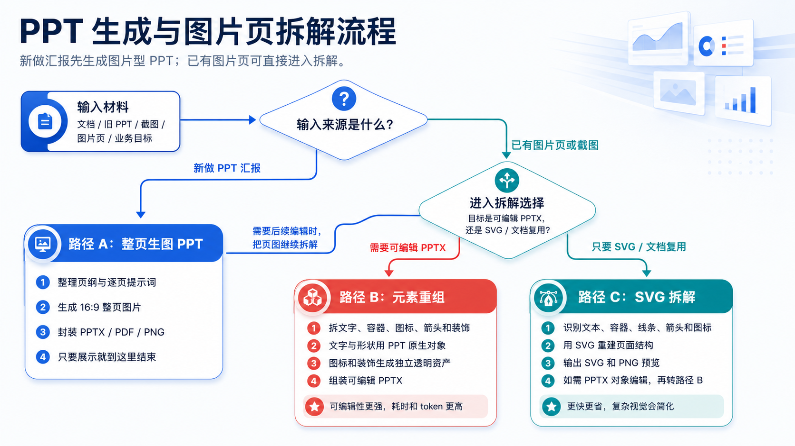
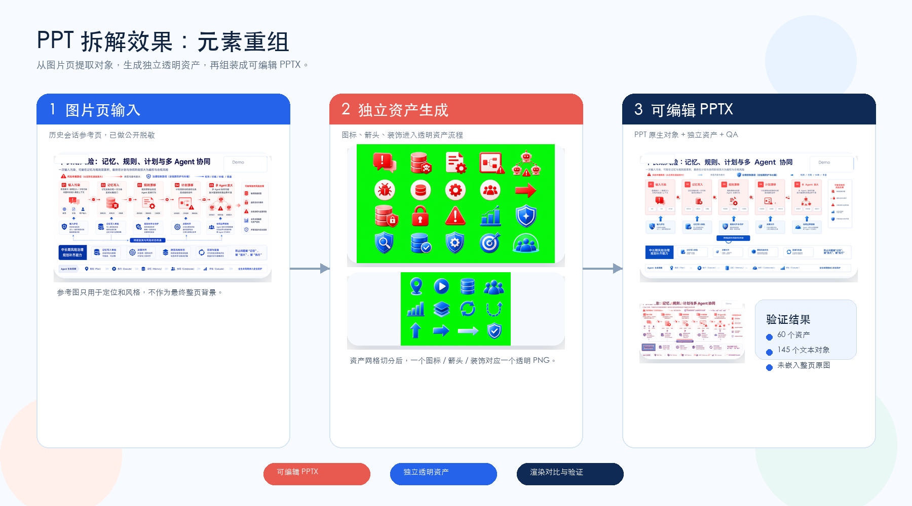
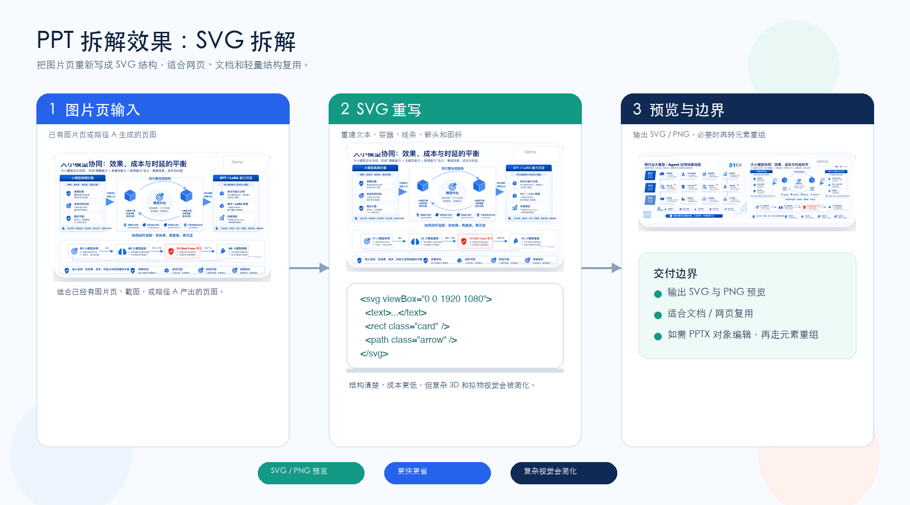

# Codex PPT Skill

面向中文 toB 商业汇报的 Codex PPT 工作流 skill：既可以生成高视觉图片型 PPT，也可以把图片页、截图页、整页生图页拆成更可编辑的 PowerPoint。

它不是一个一键万能 PPT SaaS，而是一套给 Codex 使用的工作流和工具箱。重点是把 PPT 生成、图片页封装、元素重组、SVG 拆解这些路径分清楚，让用户知道什么时候该追求视觉效果，什么时候该追求可编辑性。

## 文档怎么读

- `README.md`：给 GitHub 访问者看的项目说明，重点讲能做什么、怎么选择路径、怎么安装和验证。
- `SKILL.md`：给 Codex 执行用的路由手册，重点讲如何判断输入、选择流程、产出文件和做 QA。
- `references/`：放更细的执行边界、提示词结构、局限性和公开发布规则。
- `scripts/`：放可直接运行的封装、切图、对比和校验工具。



## 使用顺序

先看输入来源，再决定要不要进入拆解：

- 新做 PPT 汇报：先走路径 A，生成图片型 PPT；如果只需要汇报展示，到 PPTX / PDF / PNG 就结束。
- 已经有图片页、截图页、旧 PPT 渲染页：可以直接进入 PPT 拆解。
- 路径 A 生成后的页图，如果后续需要编辑或复用，也可以继续交给 PPT 拆解。
- 拆解时，要 PowerPoint 内可编辑 PPTX，优先选路径 B 元素重组；只要 SVG、文档/网页复用或低成本结构样板，再选路径 C SVG 拆解。

| 路径 | 适合目标 | 最终交付 | 关键边界 |
|---|---|---|---|
| A 整页生图 PPT | 新做方案汇报、售前材料、培训讲解、复盘展示，优先看起来好 | PPTX / PDF / PNG / 汇总预览图 / 逐页提示词 | 正文、图表和版式在图片里，不承诺全元素可编辑 |
| B 元素重组 | 已有图片页或 A 生成的页图，要重建为实用级可编辑 PPTX | 可编辑 PPTX / asset_manifest / 验证报告 / 渲染差异图 | 原图只做参考，不能把整页原图或原图硬裁片当最终素材 |
| C SVG 拆解 | 已有图片页或 A 生成的页图，只要 SVG、文档/网页复用或低成本结构样板 | SVG / SVG 预览 / 可选 PPTX 嵌入 | SVG 导入 PowerPoint 后未必保持内部对象稳定可编辑，不能当成完整 PPT 反编译 |

## 模块一：PPT 生成

这个模块解决的是：**从文档、旧 PPT、截图、图片页或业务目标出发，生成一套视觉完整的图片型 PPT。**

适合只需要汇报展示、PDF 发送、PNG 预览或一次性交付的场景。它追求的是页面完成度和视觉稳定性，不承诺每个文字、图表、图标都能在 PowerPoint 里单独编辑。

### 生成效果


| 框架页 | 矩阵页 |
|---|---|
|  |  |

| 评测体系 | 闭环流程 | 路线图 |
|---|---|---|
|  |  |  |

### 生成流程

1. 让 Codex 根据材料输出页纲和逐页详细生图提示词。
2. 用 imagegen 生成每页 16:9 整页图。
3. 真实 Logo、二维码、印章、品牌标识只在后处理叠加，不交给 imagegen 生成。
4. 用 `make pack` 或 `scripts/package_image_deck.py` 统一裁切、叠 Logo、封装 PPTX。
5. 导出 PDF 和汇总预览图做视觉 QA。
6. 若后续需要可编辑 PPTX 或 SVG，把最终页图作为 PPT 拆解模块的参考输入。

### 生成 PPT 图片的小 tip

逐页生图提示词建议固定包含：页面标题、页面目标、核心文字、版式结构、视觉元素、风格提示词、Logo 规则和负向约束。

每页只保留一个中心主张，核心文字控制在 2-4 组；画面按 16:9 设计，中文要大而清晰。真实 Logo、二维码、印章和合规标识不要交给 imagegen 生成，统一在后处理阶段叠加。

## 模块二：PPT 拆解

这个模块解决的是：**已经有图片页、截图页或路径 A 生成的页图，但后续还需要继续编辑、复用或结构化。**

拆解不是只有一种做法。需要 PowerPoint 内继续编辑时，优先选元素重组；只需要 SVG、网页/文档复用，或低成本验证结构时，选 SVG 拆解。

### 两种拆解方式

| 方式 | 什么时候选 | 时间与 token | 大概还原度 |
|---|---|---|---|
| 元素重组 | 要在 PPTX 里继续改文字、移动形状、替换图标和装饰 | 单页约 30-90 分钟，约 8-25 万 tokens | 视觉还原约 75%-90%，PPTX 可编辑性更高 |
| SVG 拆解 | 只要 SVG / PNG 预览，或用于网页、文档、轻量结构样板 | 单页约 5-20 分钟，约 1-6 万 tokens | 结构还原约 65%-85%，复杂视觉会简化，PPT 内对象级编辑不稳定 |

这些区间按复杂中文商业汇报页估算，实际会受页面复杂度、重抽次数、资产数量和 QA 标准影响，不是固定承诺。

### 拆解效果

| 元素重组：面向可编辑 PPTX | SVG 拆解：面向轻量结构复用 |
|---|---|
|  |  |

### 元素重组流程

1. 以原始截图、图片页或路径 A 生成的页图为参考，建立 `visual_inventory.json`，把页面拆成文字、容器、图标、箭头、装饰、3D 元素、风险标记等对象。
2. 建立 `asset_anchors.json`，记录每个待生成元素的 bbox、含义、目标尺寸和层级。
3. 用 imagegen/API 根据整页参考图和局部上下文生成 isolated asset grid。要求无文字、无数字、无标签、无卡片框、无背景碎片。
4. 用 `make cut` 或 `scripts/grid_cut.py` 切成一个元素一个透明 PNG。
5. 用 PPT 原生文本框、形状、容器重建信息层；用透明资产插入图标、箭头、3D 装饰。
6. 渲染 PPTX，使用 `make compare` 生成汇总预览图和差异热力图。
7. 用 `make validate` 检查没有整页原图、没有参考图 hash、没有原图硬裁片媒体，并输出验证报告。

### SVG 拆解流程

1. 适合信息图、流程页、图标线框页、结构较清晰的截图页，也适合接收路径 A 生成的页图。
2. Codex 读取参考图，按文本、容器、图标、箭头、背景结构重新写 SVG。
3. 输出 SVG 和 PNG 预览，用于网页、文档或后续手工导入。
4. 注意：SVG 导入 PowerPoint 后通常是图形对象或媒体对象，不等于所有内部路径都能稳定编辑。若目标是 PowerPoint 内对象级编辑，优先走元素重组。

## 适合什么场景

适合：

- Codex 中使用 `$imagegen-scene-ppt` 做中文商业汇报、产品方案、行业趋势、风险治理、路线图类材料。
- 用户只需要一份视觉强、可展示的 PPTX/PDF，不需要后续逐字编辑。
- 用户已有图片版 PPT、截图页或整页生图页，希望拆成更可维护的 PPTX 或 SVG。
- 用户想锤炼图片页转 PPT 的流程，愿意保留 inventory、manifest、diff、QA 报告。

不适合：

- 大量 Excel 表、财务留档、合同正文、法规原文、密集脚注。
- 要求任意图片一键变成完全原生、完全可编辑、像素级一致的 PPT。
- 需要多人长期维护的企业模板库。
- 不允许生成图、不允许人工 QA、也不接受已知限制的交付。

## 安装

安装到 Codex skill 目录：

```bash
mkdir -p ~/.codex/skills
git clone https://github.com/Ronnie2025/codex-ppt-skill.git ~/.codex/skills/imagegen-scene-ppt
```

这里目录名使用 `imagegen-scene-ppt` 是为了和 `SKILL.md` 里的触发名保持一致；仓库名仍然是 `codex-ppt-skill`。

已经安装过时更新：

```bash
cd ~/.codex/skills/imagegen-scene-ppt
git pull
```

安装后重启 Codex。触发名是：

```text
$imagegen-scene-ppt
```

示例请求：

```text
使用 $imagegen-scene-ppt 帮我做一份 toB 商业汇报 PPT，优先整页生图，最终要 PPTX 和 PDF。
```

```text
使用 $imagegen-scene-ppt 把这几张图片页拆成可编辑 PPT。不要用整页原图铺底，图标和箭头按元素重组方式生成后再组装。
```

## 快捷命令

仓库提供 `Makefile`，用于少打长命令。先把依赖安装到 `make` 实际使用的 Python 里：

```bash
python3 -m pip install -r requirements.txt
```

如果想避免本机 Python 环境混乱，可以用虚拟环境：

```bash
python3 -m venv .venv
. .venv/bin/activate
python -m pip install -r requirements.txt
make PYTHON=.venv/bin/python check
make PYTHON=.venv/bin/python demo
```

常用检查：

```bash
make help
make check
```

完整命令列表以 `make help` 为准。

整页图片封装为 PPTX：

```bash
make pack IMAGES_DIR=./output/raw-slides OUT_PPTX=./output/deck.pptx PACK_ARGS="--contact-sheet ./output/contact-sheet.jpg --export-pdf"
```

资产网格切分为透明 PNG：

```bash
make cut GRID=./output/generated/icons_grid.png ROWS=3 COLS=4 NAMES=icon_01,icon_02,icon_03,icon_04,icon_05,icon_06,icon_07,icon_08,icon_09,icon_10,icon_11,icon_12 OUT_DIR=./output/assets MANIFEST=./output/asset_manifest.json
```

参考图和渲染图对比：

```bash
make compare REF=./output/reference/page-01.png RENDER=./output/render/page-01.png COMPARE_DIR=./output/compare
```

元素重组 PPTX 校验：

```bash
make validate PPTX=./output/reconstructed.pptx REF=./output/reference/page-01.png MANIFEST=./output/asset_manifest.json INVENTORY=./output/visual_inventory.json REPORT=./output/validation_report.md
```

内置演示命令会写入 `output/demo/`，用于确认本机工具链可跑：

```bash
make demo
make pack-demo
make cut-demo
make compare-demo
```

## 脚本工具

| 脚本 | 作用 |
|---|---|
| `scripts/package_image_deck.py` | 将整页图片统一裁切为 16:9，叠加真实 Logo，封装为 PPTX，可选导出 PDF 和汇总预览图 |
| `scripts/grid_cut.py` | 将 imagegen 生成的 asset grid 切成单个透明 PNG，并生成 `asset_manifest.json` |
| `scripts/compare_render.py` | 将参考图和渲染图生成差异热区、指标和汇总预览图 |
| `scripts/validate_semantic_deck.py` | 检查 PPTX 是否嵌入参考图、整页媒体或不合规 manifest |
| `scripts/audit_pptx_editability.py` | 快速判断 PPTX 是否像图片页、是否混合文字与图片、是否含 SVG 媒体 |

## 仓库结构

```text
codex-ppt-skill/
├── SKILL.md
├── README.md
├── Makefile
├── agents/
│   └── openai.yaml
├── assets/
│   ├── examples/
│   └── workflow/
├── references/
│   ├── limitations.md
│   ├── prompt-patterns.md
│   ├── publication-boundaries.md
│   └── semantic-replica-workflow.md
├── scripts/
│   ├── audit_pptx_editability.py
│   ├── audit_public_skill.py
│   ├── compare_render.py
│   ├── grid_cut.py
│   ├── package_image_deck.py
│   └── validate_semantic_deck.py
└── templates/
    ├── asset_manifest.example.json
    ├── conversion_report.template.md
    └── visual_inventory.example.json
```

## 设计原则

- 新做 PPT 汇报先生成图片型 PPT；已有图片页或 A 生成的页图，才进入元素重组或 SVG 拆解。
- 图片型 PPT、可编辑 PPTX、SVG 是三种不同承诺。
- 不把图片型 PPT 说成可编辑 PPT。
- 不把整页截图、局部原图硬裁片、带残字的裁片当成最终可编辑重建资产。
- 复杂图标、箭头、3D 元素、UI 装饰应拆成独立元素，再生成透明资产。
- 中文文字、数字、来源、Logo、二维码、合规标识优先用后处理或 PPT 原生对象处理。
- 每次交付都保留提示词、预览、对比、验证报告和已知限制。

## License

MIT
