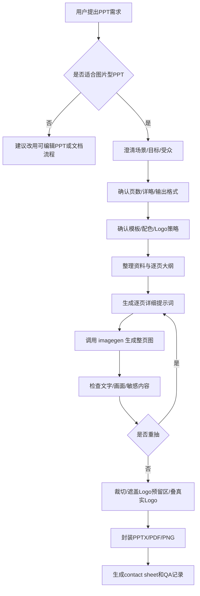

# Codex PPT Skill

一个面向 Codex 的图片型 PPT 制作 skill。它不是通用 PPT 模板库，而是一套**单点沟通场景的生图 PPT 工作流**：先用对话把目标、受众、风格、页数、Logo 和输出格式问清楚，再用 imagegen 生成带文字的整页幻灯片图片，最后封装成 PPTX / PDF / PNG。


## 适合什么场景

适合：

- 需要快速做一份有完整观感的汇报材料，而不是长期维护的编辑母版
- 需要强视觉表达、统一风格、缩略图好看，适合现场讲解或客户交流
- 围绕一个明确沟通目标展开，而不是多主题资料合集
- 接受正文和图表以图片形式存在，不要求所有文字、图表、形状可编辑
- 希望保留逐页提示词，方便后续重抽、迁移和复用

不适合：

- 财务报表、经营复盘、指标看板等强数据精确材料
- 后续需要频繁修改文字、表格和图表的材料
- 必须严格遵循企业母版、字号、边距、版式规范的正式模板文件
- 文字非常密集、脚注很多、长表格很多的留档型文档
- Logo、品牌、法律披露有像素级要求，且不能通过后处理校正

## 工作流



## 这个 skill 会先问什么

在正式生图前，Codex 会先确认这些关键项：

- 使用场景：正式汇报 / 售前交流 / 内部同步 / 方案介绍 / 培训讲解 / 复盘展示
- 沟通目标：让对方理解 / 认同方案 / 支持决策 / 进入 POC / 形成共识 / 展示成果
- 受众类型：高层 / 业务方 / 技术方 / 运营方 / 客户 / 内部团队
- 页数范围：短版 / 标准版 / 详版
- 内容详略：轻量视觉版 / 标准汇报版 / 详版留存版
- 视觉风格：白底商务 / 科技感 / 深色大屏 / 咨询报告 / 产品发布 / 轻营销 / 模板派生
- 模板要求：沿用模板 / 只提取配色和 Logo / 不使用模板
- Logo 策略：每页 Logo / 只封面尾页 / 不加 Logo
- 输出格式：PPTX / PDF / 每页 PNG / 逐页提示词 / QA 记录 / 来源证据清单
- 禁止内容：客户名、内部指标、真实样本、报价、敏感案例、未经确认来源、模型参数

## 生图提示词结构

每页都会保留提示词，便于复用和重抽。结构如下：

```text
页面标题：
{精确标题}

页面目标：
{这一页要让受众理解什么}

核心文字：
- {短要点1}
- {短要点2}
- {短要点3}

版式结构：
{链路图 / 场景地图 / 矩阵 / 飞轮 / 左右对照 / 路线图 / 架构图等}

视觉元素：
{控制台、系统节点、文档墙、风险告警、流程箭头、产品界面等}

风格提示词：
16:9 整页 PPT 图片，{配色}，{气质}，{背景}，中文文字清晰，层级专业。

Logo 规则：
预留真实 Logo 后叠区域。不要生成 Logo、伪 Logo、品牌标识、水印、二维码或印章。

负向约束：
不要水印、二维码、长 URL、伪 Logo、乱码、虚假数据、未经确认的信息、内部敏感内容、不可读小字。
```

更多提示词模式见 [references/prompt-patterns.md](./references/prompt-patterns.md)。

## 示例页面

以下图片只用于展示“整页生图 + 后处理封装”的效果，已遮盖品牌标识。

| 链路页 | 框架页 |
|---|---|
|  |  |

| 矩阵页 | 评测体系 |
|---|---|
|  |  |

## 安装

### 安装到 Codex skills

```bash
mkdir -p ~/.codex/skills
git clone https://github.com/Ronnie2025/codex-ppt-skill.git ~/.codex/skills/imagegen-scene-ppt
```

重启 Codex 后即可使用。触发方式可以是：

```text
帮我做一份单点场景的高视觉图片型 PPT
用 imagegen-scene-ppt 做一个客户交流用的 PPT
我想用生图方式生成一份 PPT，先帮我澄清需求
```

### 手动复制

也可以把仓库中的 `SKILL.md`、`references/`、`scripts/`、`agents/` 放到你的 skill 目录中。

## 目录结构

```text
codex-ppt-skill/
├── SKILL.md                         # skill 主流程
├── README.md                        # 项目说明
├── agents/
│   └── openai.yaml                  # Codex 展示元信息
├── assets/
│   └── examples/                    # 脱敏示例图
├── references/
│   └── prompt-patterns.md           # 生图提示词模式和示例
└── scripts/
    └── package_image_deck.py        # 图片裁切、Logo后叠、PPTX封装脚本
```

## 打包脚本

`scripts/package_image_deck.py` 可以把已经生成好的 slide 图片封装成 PPTX：

```bash
python scripts/package_image_deck.py \
  --images-dir ./output/raw-slides \
  --out-pptx ./output/deck.pptx \
  --final-dir ./output/final-slides \
  --contact-sheet ./output/contact-sheet.jpg \
  --slide-count 12 \
  --logo ./assets/logo.png \
  --mask-logo-zone \
  --export-pdf
```

脚本能力：

- 将原始图片中心裁切或缩放为统一 16:9
- 可选遮盖右上角 Logo 预留区
- 可选叠加真实 Logo
- 可选封面/尾页页脚 Logo
- 生成图片型 PPTX
- 生成 contact sheet
- 本机有 LibreOffice / soffice 时可导出 PDF

## 设计原则

1. 先判断适配性，不合适就切换到可编辑 PPT 或文档流程。
2. 先澄清场景、受众、风格和输出，再开始生图。
3. 每页只保留一个中心主张，避免文字过密。
4. 真实 Logo 一律后处理叠加，不交给 imagegen。
5. 每次交付都保留逐页提示词和 QA 记录，方便重抽和复用。

## License

MIT
