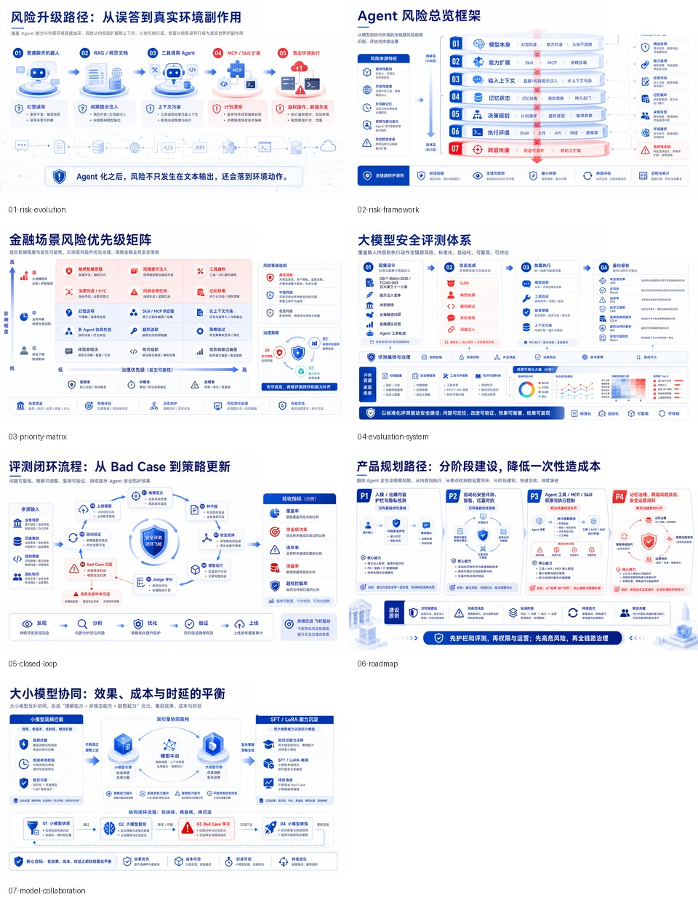
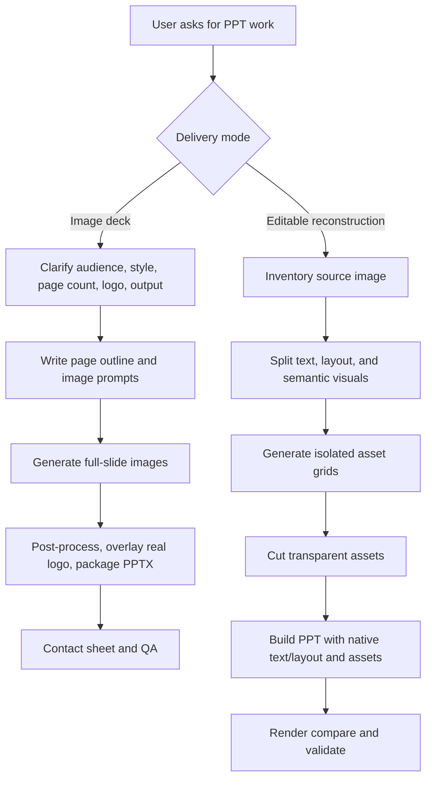

# Codex PPT Skill

Codex skill for two related presentation workflows:

1. **Image-generated scene decks**: generate visually polished, image-based PPT pages with imagegen, then package them into PPTX/PDF/PNG.
2. **Semantic editable reconstruction**: rebuild image-only slides or screenshots into practical editable PPTX by separating native text/layout from generated transparent visual assets.

The skill is designed for presentation work where visual quality matters, but it explicitly distinguishes image-only delivery from editable reconstruction.



## When To Use

Use image-generated scene deck mode when:

- the deck has one clear communication goal;
- strong visual rhythm matters more than later object-level editing;
- generated text/images are acceptable after QA;
- real logos can be overlaid in post-processing.

Use semantic editable reconstruction mode when:

- the source is an image-only PPT, screenshot, or rendered slide;
- text should become editable PPT text;
- cards, panels, dividers, and layout structure should become native shapes;
- icons, arrows, 3D visuals, badges, and decorative UI should become independent transparent assets;
- raw source crops would produce hard edges, residual text, or clipped objects.

## Workflow Summary



## Install

```bash
mkdir -p ~/.codex/skills
git clone https://github.com/Ronnie2025/codex-ppt-skill.git ~/.codex/skills/imagegen-scene-ppt
```

Restart Codex after installation.

Example prompts:

```text
Use $imagegen-scene-ppt to create a high-visual image-based deck for a product briefing.
```

```text
Use $imagegen-scene-ppt to rebuild these slide screenshots as an editable PPTX with semantic visual assets.
```

## Repository Structure

```text
codex-ppt-skill/
├── SKILL.md
├── agents/
│   └── openai.yaml
├── assets/
│   └── examples/
├── references/
│   ├── prompt-patterns.md
│   └── semantic-replica-workflow.md
├── scripts/
│   ├── audit_public_skill.py
│   ├── compare_render.py
│   ├── grid_cut.py
│   ├── package_image_deck.py
│   └── validate_semantic_deck.py
└── templates/
    ├── asset_manifest.example.json
    ├── conversion_report.template.md
    └── visual_inventory.example.json
```

## Image Deck Packaging

`scripts/package_image_deck.py` packages already-generated slide images into a PPTX:

```bash
python scripts/package_image_deck.py \
  --images-dir ./output/raw-slides \
  --out-pptx ./output/deck.pptx \
  --final-dir ./output/final-slides \
  --contact-sheet ./output/contact-sheet.jpg \
  --slide-count 12 \
  --logo ./assets/logo.png \
  --mask-logo-zone \
  --export-pdf
```

## Semantic Asset Cutting

Generate isolated image assets on a chroma-key background, then cut them:

```bash
python scripts/grid_cut.py \
  --grid ./generated/domain_icons_grid.png \
  --rows 3 \
  --cols 4 \
  --names domain_icon_01,domain_icon_02,domain_icon_03,domain_icon_04,domain_icon_05,domain_icon_06,domain_icon_07,domain_icon_08,domain_icon_09,domain_icon_10,domain_icon_11,domain_icon_12 \
  --out-dir ./assets/generated \
  --manifest-out ./asset_manifest.json
```

## Render Comparison

After rendering PPTX pages to PNG, compare them with references:

```bash
python scripts/compare_render.py \
  --reference ./reference/page-01.png \
  --render ./render/page-01.png \
  --out-dir ./compare
```

## Semantic Deck Validation

Validate that the reconstructed PPTX does not embed source images as final media:

```bash
python scripts/validate_semantic_deck.py \
  --pptx ./output/reconstructed.pptx \
  --reference ./reference/page-01.png \
  --manifest ./asset_manifest.json \
  --inventory ./visual_inventory.json \
  --full-slide-size 1920x1080 \
  --out ./validation_report.md
```

## Public Release Audit

Before publishing a reusable skill package:

```bash
python scripts/audit_public_skill.py --root .
```

The audit checks for obvious local paths, secrets, and project residue. It is not a substitute for human review of images, PDFs, and PPTX files.

## Principles

- Do not present image-only decks as editable decks.
- Do not use raw rectangular crops as final semantic assets.
- Real logos are overlaid after generation, not drawn by imagegen.
- Public examples must be synthetic or fully anonymized.
- Always keep prompts, render previews, comparison artifacts, validation notes, and known limitations.

## License

MIT
